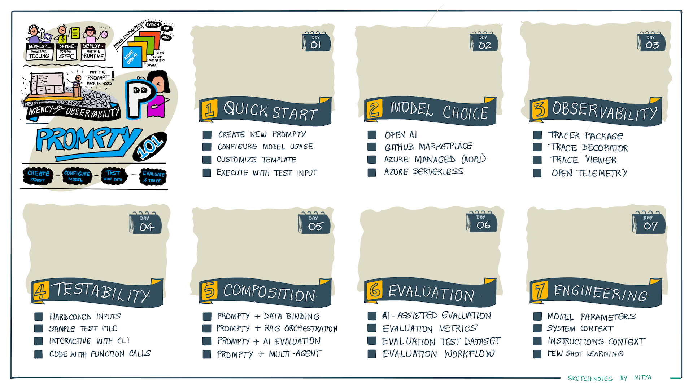

# Welcome

By [definition](https://prompty.ai), Prompty is _a new asset class and format for LLM prompts that aims to provide observability, understandability, and portability for developers._ In this workshop, we explore what this means from core concepts to prompty prototyping in a series of hands-on labs.

## Learning Objectives

The workshop is structured as a series of hands-on labs taking you from core concepts to prompt evaluation and composition, with code. On completion, you should be able to describe:

1. What Prompty is and the benefits it offers
2. How to create and execute a simple Prompty asset
4. How to choose and configure models for your prompt
3. How to engineer prompts for different scenarios
5. How to instrument Prompty assets for observability
6. How to evaluate prompts to assess quality and safety
7. How to compose Prompty assets for complex flows

## Pre-Requisites

To complete these labs you will need:

1. A personal GitHub account (create one [for free](https://github.com/signup))
1. A Microsoft Azure account (create one [for free](https://azure.microsoft.com/free/))
1. Basic familiarity with Python syntax and tools
1. Basic familiarity with Generative AI concepts
1. Basic familiarity with Visual Studio Code tooling

## Learning Modules

The workshop is organized into modules, each focused on one topic and containing a series of hands-on lab units. Click the module title to see details of the units.

??? note "1. Core Concepts"
    - Prompty Specification
    - Prompty Tooling
    - Prompty Runtime

??? note "2. Prompty Quickstart"

    - Create a new Prompty asset
    - Configure asset with a model
    - Configure asset with a prompty template
    - Execute asset with a hardcoded input

??? note "3. Prompt Engineering"

    - By modifying model parameters
    - By modifying system context
    - By modifying prompt instructions
    - By adding grounding context

??? note "4. Model Choice"

    Refactor prompty asset to use models sourced from:

    - GitHub Marketplace
    - Open AI 
    - Azure OpenAI 
    - Azure AI Model Catalog (serverless API)
    - LlamaIndex 

??? note "5. Prompty Observability"

    - Instrumenting assets for tracing
    - Viewing trace logs in the Prompty UI

??? note "6. Prompty Testing"

    - With a sample data file
    - With hardcoded data inputs
    - With interactive data inputs from CLI

??? note "7. Prompty Composition"

    - Chain prompty assets for evaluation
    - Chain prompty assets for orchestration

??? note "8. Prompty Evaluation"

    - By writing custom evaluators
    - By running evaluators with test data
    - By assessing quality with test data
    - By running evaluators with adversarial data
    - By assessing safety with adversarial data

## Learning Resources

Bookmark and explore these resources:

- [Documentation](https://prompty.ai/) - official documentation, in-progress.
- [Repository](https://github.com/microsoft/prompty) - open-source repository.
- [Prompty in Promptflow](https://microsoft.github.io/promptflow/tutorials/prompty-quickstart.html#) - with [examples](https://github.com/microsoft/promptflow/tree/main/examples/prompty)

Watch the Microsoft Build 2024 session for a practical tour of end-to-end usage.

<iframe width="800" height="450" src="https://www.youtube.com/embed/HALMFU7o9Gc" title="Practical End-to-End AI Development using Prompty and AI Studio | BRK114" frameborder="0" allowfullscreen></iframe>

